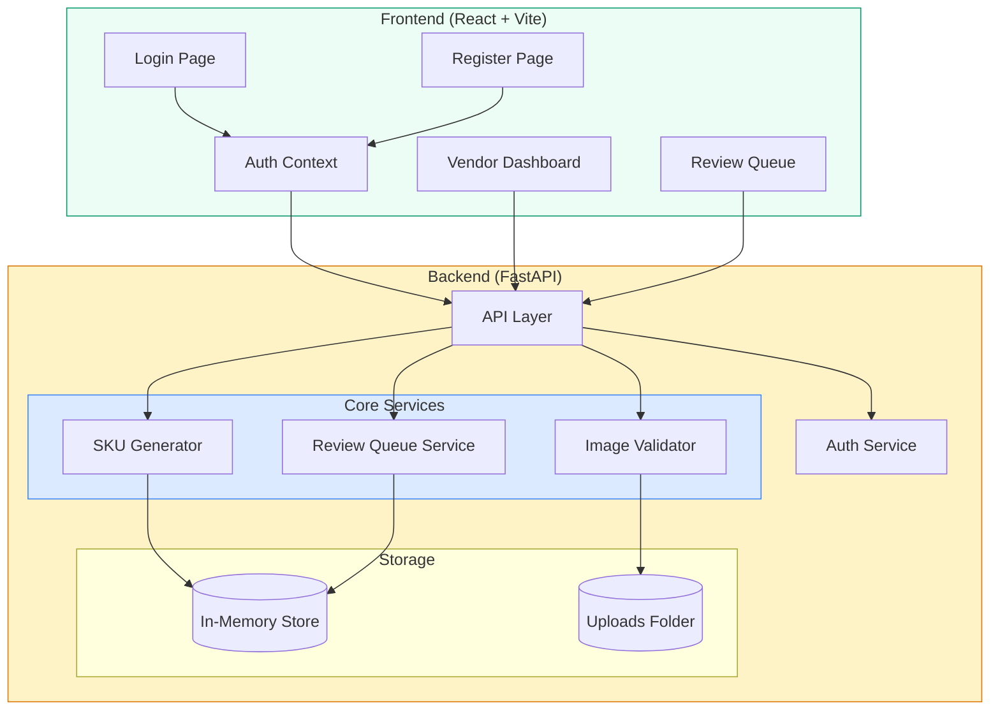

# Catalyze

**Product Image Review & Approval Platform** — A full-stack application for product image validation with a human-in-the-loop review workflow.


---

## Demo


https://github.com/user-attachments/assets/5493ccbf-13a6-4fc3-aeab-a6bed48a7c46


---

## Features

### Core Capabilities
- **Image Review Workflow** — Vendors upload product images, reviewers approve or reject
- **Automated Quality Checks** — Background whiteness, blur detection, object coverage analysis
- **Real-time Queue Statistics** — Track pending reviews, completion rates, and SLA metrics
- **Role-based Access** — Separate dashboards for vendors and reviewers

### User Roles
| Role | Capabilities |
|------|-------------|
| **Vendor** | Upload product images, track submission status, receive feedback |
| **Reviewer** | Review pending submissions, approve/reject with feedback |

---

## Architecture



---

## Project Structure

```
catalyze/
├── backend/
│   ├── config.py              # Configuration settings
│   ├── main.py                # Original FastAPI app
│   └── services/
│       ├── sku_generator.py   # SKU generation logic
│       ├── image_validator.py # Image quality validation
│       └── review_queue.py    # Review workflow service
│
├── frontend/
│   ├── src/
│   │   ├── App.tsx            # Root component with routing
│   │   ├── index.css          # Global styles (matcha theme)
│   │   ├── context/
│   │   │   └── AuthContext.tsx
│   │   └── pages/
│   │       ├── Login.tsx
│   │       ├── Register.tsx
│   │       └── VendorDashboard.tsx
│   ├── pages/
│   │   └── ReviewQueue.tsx
│   ├── vercel.json            # Vercel deployment config
│   └── package.json
│
├── run_server.py              # Main server entry point
├── render.yaml                # Render deployment config
├── requirements.txt           # Python dependencies
└── README.md
```

---

## Quick Start

### Prerequisites
- Python 3.9+
- Node.js 18+

### Installation

```bash
# Clone repository
git clone https://github.com/PranavKKK2311/Image-Pipeline-Review-System.git
cd Image-Pipeline-Review-System

# Backend setup
python -m venv venv
source venv/bin/activate  # Windows: venv\Scripts\activate
pip install -r requirements.txt

# Frontend setup
cd frontend
npm install
```

### Run Locally

```bash
# Terminal 1 - Backend
python run_server.py

# Terminal 2 - Frontend
cd frontend
npm run dev
```

**Access:**
- Frontend: http://localhost:5173
- API Docs: http://localhost:8000/docs

---

## Deployment

| Service | Platform | URL |
|---------|----------|-----|
| Frontend | Vercel | [image-pipeline-review-system-dotl.vercel.app](https://image-pipeline-review-system-dotl.vercel.app) |
| Backend | Render | [image-pipeline-review-system.onrender.com](https://image-pipeline-review-system.onrender.com) |

---

## API Endpoints

### Authentication
| Method | Endpoint | Description |
|--------|----------|-------------|
| POST | `/api/v1/auth/register` | Register new user |
| POST | `/api/v1/auth/login` | Login user |
| GET | `/api/v1/auth/me` | Get current user |

### Images (Vendor)
| Method | Endpoint | Description |
|--------|----------|-------------|
| POST | `/api/v1/images/upload` | Upload product image |
| GET | `/api/v1/images/my-submissions` | Get vendor's submissions |

### Review (Reviewer)
| Method | Endpoint | Description |
|--------|----------|-------------|
| GET | `/api/v1/review/pending` | Get pending tasks |
| GET | `/api/v1/review/stats` | Get queue statistics |
| POST | `/api/v1/review/submit-decision` | Submit review decision |

---

## Tech Stack

| Layer | Technology |
|-------|------------|
| **Frontend** | React 18, TypeScript, Vite |
| **Backend** | Python 3.9+, FastAPI, Pydantic |
| **Styling** | CSS with glassmorphism effects |
| **Auth** | JWT (in-memory for demo) |

---

## License

MIT License
